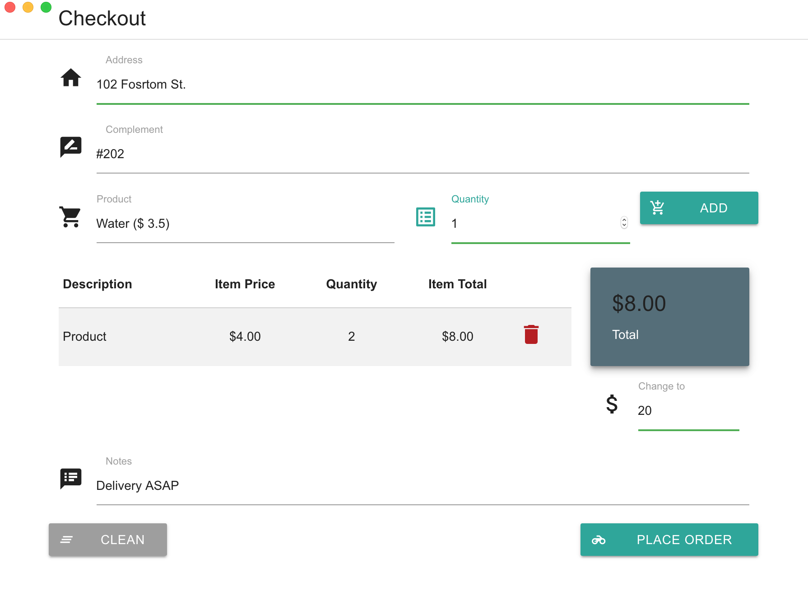

# Delivery System

Simple application to cover orders made by the call to a small delivery company

  

## MVP
- Open the app in Order page
- Fields required
  - Address
  - Complement
  - Product
    - Item
    - Quantity
    - (Show the unity value)
  - Note
- It should show the Total Order
- Change value for
- Typing the address should be suggested matches options to be selected
- When choose a suggestion address, to fill the product and quantity;
- Print the order

## Requirements
- Works in offline mode
- Windows machine
- Language pt-BR

## Tech stack
- ElectronJs
- ReactJs
- Materializecss ([Grid - Materialize](https://materializecss.com/grid.html))
- Lowdb (local persistent) (verify use on windows to see how works)
- i18n -linguijs

## Local Database anaslise
- Data per year: 
  - Order: 140(orders per day)*262bytes*30*12 = 13,2048 ; 14mb per year
[lowdb/examples at master · typicode/lowdb · GitHub](https://github.com/typicode/lowdb/tree/master/examples)

## Spike
- [x] Try to print something (branch: *printer-node-plugin*)

## Evolution
- See orders by range date with a total value to *management* user
- Sync local data to the cloud
- Smart organize the delivery routes
- Customer request order by Internet
- To get the phone number by modem
